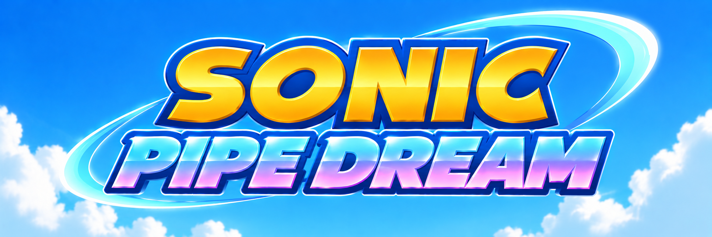

# Sonic Pipe Dream

**A 3D half-pipe racer, born from Sonic 2's special stage.**

> **In active development.** Sonic Pipe Dream is a work in progress: stages, controls and the way
> it plays may change from one build to the next, and some features are not there yet.

Race Sonic down a twisting half-pipe that hangs in a sky full of shifting diamonds. Grab the
rings, dodge the bombs, and reach each ring check with enough rings to pass it. Get through all
three checks in a stage and the chaos emerald is yours.

It started as a love letter to Sonic 2's special stage and has grown into its own game: its own
seven stages, its own ring and bomb patterns, its own feel in the air, and a sky you could watch
for hours.

## Features

- **Seven stages**, each with its own track, its own pipe colours, its own sky and its own chaos
  emerald: blue, yellow, purple, green, red, sky and white.
- **Run anywhere round the pipe** -- up the walls, over the top and back down, without end.
  Hold a direction and Sonic winds up past his normal speed; let go and he slides back down.
- **Jump and drop dash.** Leap across the pipe with all your speed behind you, or jump again in
  mid-air to dash straight back down.
- **Ring checks** that ask more of you stage by stage. Every check can be passed with the rings
  the section holds; the last stages leave very little room for mistakes.
- **Eight animated skies**, from a classic special stage blue to sunset, aurora, inferno and
  midnight.
- **A stage select** with a moving preview of every stage, and your emeralds remembered between
  sessions.
- **Coming:** Marathon, one endless run that gets harder as it goes and changes colour every
  third check.

## Controls

| | Menus | Stage |
|---|---|---|
| Up / Down (or W / S) | Move the highlight | Pause menu |
| A / D | | Steer round the pipe |
| Space | Choose | Jump; again in the air to drop dash |
| Enter | Choose | |
| Escape | Back | Pause: Continue or Exit |
| Backspace | Back | |
| R | | Restart the stage |

## Platforms

- **Windows**: download the latest build from [Releases](https://github.com/myuu-151/SonicPipeDream/releases), unzip it and run `Sonic2Special3D.exe`.
- **GameCube**, as a disc image: [Sonic Pipe Dream (GameCube)](https://github.com/myuu-151/SonicPipeDream-GC).

## More

How it is made -- the stage and track generators, the ring and bomb patterns, the skies -- is in
[docs/development.md](docs/development.md).

## Credits

- **Music**: megabaz
- **Sonic model**: murissargb
- **Lives icon**: eris1521987

Built on the [Octave engine](https://github.com/myuu-151/Octave-libogc).

*A fan game, not affiliated with SEGA. Sonic the Hedgehog is a trademark of SEGA.*
