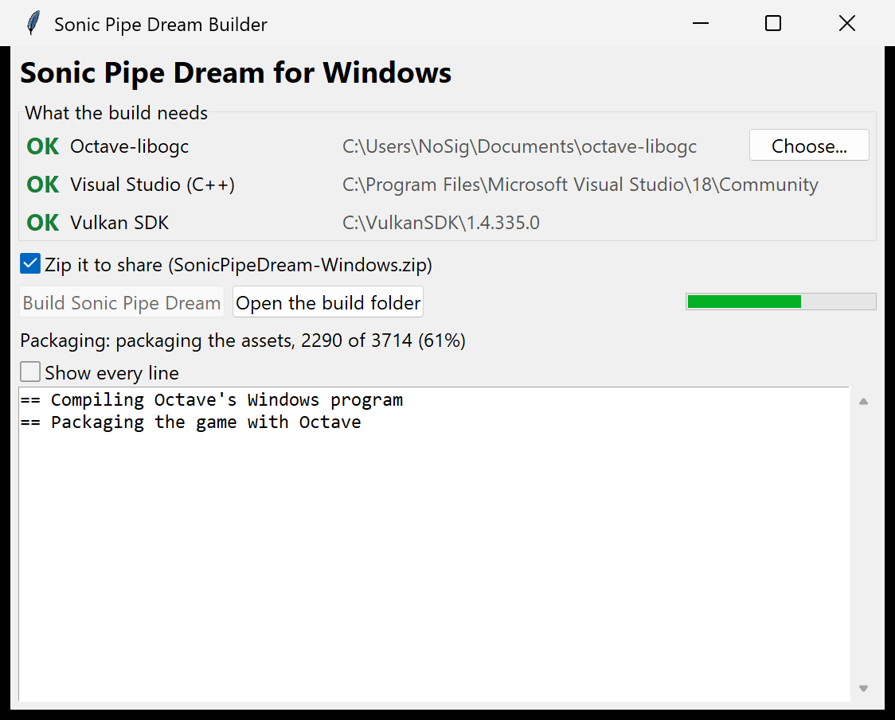

# Sonic Pipe Dream

**A modern take on Sonic 2's iconic half-pipe special stage, in full 3D.**

> **In active development.** Sonic Pipe Dream is a work in progress: stages, controls and the way
> it plays may change from one build to the next, and some features are not there yet.
>
> Found a bug? Please report it as a ticket on the
> [Issues page](https://github.com/myuu-151/SonicPipeDream/issues): what happened, what you expected,
> and how to make it happen again if you can.

## Controls

| Keyboard | Controller | Menus | Stage |
|---|---|---|---|
| A / D | Stick or d-pad | | Steer round the pipe |
| Up / Down (or W / S) | Stick or d-pad | Move the highlight | Move the highlight, paused |
| Space | A | Choose | Jump; again in the air to drop dash; hold through a landing to bounce highest |
| E (hold) | R (hold) | | Spin dash: skid to a stop, press jump to rev, let go to blast off |
| Enter | A / Start | Choose | |
| Escape | Start | Back | Pause: Continue or Exit |
| Backspace | B | Back | |
| R | | | Restart the stage; in Marathon and Time Attack, a new run |

## Platforms

- **Windows**: download the latest build from [Releases](https://github.com/myuu-151/SonicPipeDream/releases), unzip it and run `Sonic2Special3D.exe`.
- **GameCube**, as a disc image: [Sonic Pipe Dream (GameCube)](https://github.com/myuu-151/SonicPipeDream-GC).

## Building it yourself

Everything the game needs is in this repo. You need:
- **[Octave-libogc](https://github.com/myuu-151/Octave-libogc)**: a clone of its source, with its
  editor (`Octave.exe`) at the root, as the v2.2 release has it.
- **Visual Studio** with "Desktop development with C++".
- **The [Vulkan SDK](https://vulkan.lunarg.com)**: it compiles the shaders.
- **Python 3**, for the builder.

Double-click **`Build Sonic Pipe Dream.bat`**. The builder window checks each of those and says
how to fix anything missing. One button then compiles Octave's Windows program (two projects at a
time, at low priority), packages the game with Octave and, if ticked, zips it to share. Each step
shows how far it is; nothing opens a window of its own. The first build takes about ten minutes,
later ones about three. The game is `proj/Packaged/Windows/Sonic2Special3D.exe`, and the zip
`proj/Packaged/SonicPipeDream-Windows.zip`.

## More

How it is made -- the stage and track generators, the ring and bomb patterns, the skies -- is in
[docs/development.md](docs/development.md).

## Credits

- **Music**: Falk
- **Sonic model**: murissargb
- **Lives icon**: eris1521987

Built on the [Octave engine](https://github.com/myuu-151/Octave-libogc).

*A fan game, not affiliated with SEGA. Sonic the Hedgehog is a trademark of SEGA.*
