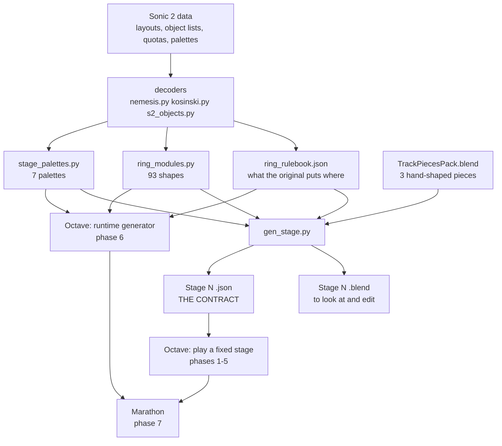

# Implementation plan

The whole project on one page: what the game is, what exists, what does not, and the order
to build the rest in. Each phase ends in a test, so "done" is never a matter of opinion.

Last brought up to date 2026-09-20. **Everything marked done is on the Blender/Python side.
Nothing of the game itself runs in Octave yet** except the sky and the music
(`proj/Scripts/Sky.lua`, `SpecialStageMusic.lua`). That line is the most important fact
in this document.

- [1. The game](#1-the-game)
- [2. Where things stand](#2-where-things-stand)
- [3. How it fits together](#3-how-it-fits-together)
- [4. The data contract](#4-the-data-contract)
- [5. The phases](#5-the-phases)
- [6. Decisions still open](#6-decisions-still-open)
- [7. Risks](#7-risks)
- [8. Before this repo is ever public](#8-before-this-repo-is-ever-public)
- [9. Where everything is](#9-where-everything-is)

---

## 1. The game

The Sonic 2 special stage, in real 3D. Sonic runs down a half-pipe, steering round its
inside, collecting rings and avoiding bombs. The design below is the project owner's.

**Sections and checks.** A stage is made of *sections*. A section is a stretch of track
that ends at a **ring check**, which asks for a number of rings (cumulative). Fall short
and the stage ends.

**The gauntlet: stages 1 to 7.** What the menu lists. Each is three sections; the third
check leads to the **emerald**. Authoritative: everyone plays the same seven, so each has
one fixed seed. Difficulty climbs on three curves at once -- stage 7 asks for more than
four times the rings stage 1 does, offers next to nothing spare (x1.05 against x2.2), and
throws them faster -- so **low stages are roomy and forgiving, high ones long and
unforgiving**. Each stage has **its own pipe colour**, the original's.

**The marathon.** Unlocked in the menu when the seventh emerald is won. **One continuous
run with no end**, always unique -- no run and no stage in it is ever played twice -- and
harder section by section. Sections come
in threes -- a *zone* -- and after each third check:

> the camera zooms in on Sonic, thumbs up, running on plain straight pipe, and he keeps
> running on it for as long as the next zone takes to build. Then the zoom lets go, the
> **palette has shifted** -- new sky, new pipe colours -- and the run resumes.

**The ring check sequence.** Every section ends on a long empty run of straights. Sonic
runs straight for a bit, then passes under the **rainbow arch** -- the one arch whose spheres
wear rings, cycling through colours, seen nowhere else -- and **the count is taken the
instant he passes it**. Around it:
the "rings to go" call some way before; at the check a **logo drops in at the top** of the
screen and the count is taken; on a pass **the camera turns to Sonic and he gives the
thumbs up** (`RunThumbsUp`); then play resumes. The intro and the ending of a stage are
straights as long as a check, and the pipe runs on past the emerald.

**The guarantee.** A section always holds enough rings to pass its own check, from
nothing, by a set margin. It is enforced, not hoped for.

---

## 2. Where things stand

| Area | State | Notes |
|---|---|---|
| Original data decoded | **done** | track layouts (Nemesis), ring/bomb lists (Kosinski), quotas, palettes |
| Track pieces | **done** | 3 authored shapes give 5 pieces; baked to one mesh each |
| Ring and bomb modules | **done** | 94, checked against all seven original stages: 3,250 objects, 0 unexplained |
| Ring model, bomb model | **done** | generated; bomb is 4,000 tris (heavy for GameCube) |
| Laying modules on bent track | **done** | `ChainPath`, `lay()`; all 93 checked on every piece |
| Stage generator | **done** | sections, checks, guarantee, intro/ring check/ending, variety by tier |
| The seven gauntlet stages | **done, as `.blend` + `.json`** | not yet playable |
| Marathon generator | **done, as a preview** | zones build from their key alone (verified) |
| Stage colours | **done in Blender** | seven palettes; sky is only *named* per palette |
| Sky | **done in Octave** | eight skies, switchable at runtime (`skies.md`) |
| Sonic | **model, rig, 3 animations** | Idle, Run, RunThumbsUp; not in a scene that plays |
| Music | **done in Octave** | intro and loop |
| Placeholder UI | **written, not yet run** | `SpecialStageUI.lua`: HUD, START dropping in and scattering, COOL ! with the emblem; a demo loop until there is a game |
| **Anything playable** | **not started** | no player, no track in-engine, no rings |
| Engine data export | not started | phase 1 |
| Runtime generator (for the marathon) | not started | phase 6 |
| Ring check sequence, hold, menus, saves | not started | phases 4, 5, 7 |
| Reachability check | not started | the guarantee counts rings that *exist*, not ones that can be *got* |

---

## 3. How it fits together

Two ideas carry the whole thing.

**A stage is a list, not a model.** Track is five pieces set down end to end with one rigid
transform each; objects are modules laid along it. Only the next few pieces need to exist
at once, which is what makes a GameCube plausible and a marathon possible.

**Everything lives in track coordinates.** A ring is `(frame, angle)`: how far along, how
far round the pipe. So is the player. That is the original's own representation, and it
makes the game side far simpler than it looks: **collision is comparing two numbers**, not
a physics query, and a shape needs no corner or slope variant because the track bends it.

---

## 4. The data contract

`external/stages/<name>.json`, written by `gen_stage.py`. The engine reads this and
nothing else to play a stage.

| Field | What |
|---|---|
| `mode`, `stage`, `seed`, `name` | gauntlet or marathon; which; how it was seeded |
| `step` | world units per frame along the track |
| `pieces` | the track, in order: `Straight`, `CornerLeft`, `CornerRight`, `Drop`, `Rise` |
| `sections[]` | one per check, below |
| `palettes` | all seven: material colours, the three shades of each colour, sky number |
| `kinds` | which modules were used, for reference |
| `zones[]`, `marathon_rules` | marathon only: each zone's key and palette; every constant needed to design section N |

Per section: `first_frame`, `check_frame`, `last_frame`; `ring_check` (where the empty
zone starts, where the count is taken, where it ends); `quota` (cumulative) and `asks`;
`rings`, `bombs`, `margin`; `difficulty`, `forgiveness`, `ring_rate`, `flavour`; `palette`;
`leads_to` (`section N`, `EMERALD`, `on`, `PALETTE SHIFT`); `hold` (marathon third checks);
and `objects`: `[frame, angle, "ring" | "bomb"]`, angle in 256ths of a circle from the
floor's centre line.

**Missing from the contract, needed by phase 1:** the geometry of each piece -- its centre
line as samples, its length, and the transform from its start to its end -- so the engine
can place pieces and turn `(frame, angle)` into a position without Blender.

---

## 5. The phases

In order. Each builds on the one before and can be played or tested when it ends.

### Phase 0 -- tooling and content *(done)*

Decoders, modules, models, generator, the seven stages, the marathon preview, the docs.
See section 9.

### Phase 1 -- get the content into Octave

1. **One engine data file**, exported by a new `native/export_engine_data.py`: the five
   pieces' geometry (centre-line samples, length, end transform), the 93 modules, the
   rulebook's cards by tier and track kind, the seven palettes, the three curves and every
   marathon constant. One file, so the engine never parses Python.
2. **The five baked piece meshes** into `proj/Assets/Meshes`, with the seven `HP_*`
   materials as Octave materials whose colours can be set at runtime.
3. **Ring and bomb** meshes and materials (the ring's gold and the bomb's red glow are
   Octave's job, by design).
4. Copy the seven stage `.json` files into the project.

**Done when:** a test scene loads `Stage1_seed1.json`, sets down all 105 pieces from the
exported geometry, and they line up with `Stage1_seed1.blend` to within a unit at the far
end.

### Phase 2 -- run down a stage

1. **Track streaming:** keep only the pieces within N of the player alive; spawn ahead,
   free behind.
2. **The player in track coordinates:** state is `(distance, angle, height off the
   surface)`. Forward speed is constant (the original's is); left/right moves the angle;
   the world position comes from the piece's centre line, exactly as `lay()` does it.
3. **The pipe's physics, such as they are:** gravity pulls the angle back toward the
   floor; enough speed carries Sonic up the wall and, as in the original, over the top;
   jump lifts him off the surface.
4. **Camera** behind and above, following the track's frame, not the world's.
5. **Sonic:** `Run` while moving, facing along the track, standing square to the pipe
   under him (the same `roll()` the bombs use).

**Done when:** stage 1 can be run start to finish, round corners and down drops, without
leaving the pipe or the camera clipping it.

### Phase 3 -- rings and bombs

1. **Spawn** the section's `objects` as pooled instances, a window ahead of the player,
   each stood square to the pipe (`roll`). Rings spin.
2. **Collision in track coordinates:** a hit is `|frame difference|` and `|angle
   difference|` both under a threshold, and height within reach. No physics engine.
3. **Rules, from the original:** a ring is +1; a bomb costs 10 rings and a stumble.
4. **HUD:** the ring count, and the rings still to go.

**Done when:** running stage 1 perfectly collects exactly the 289 rings its `.json` says it
holds.

### Phase 4 -- the ring check

The zone is already marked in the data (`ring_check`, and `Check`, `CheckLogo`,
`CheckPass`, `RingsToGo` in the `.blend`).

1. `RingsToGo` frame: the "N rings to go" call. Animate the rainbow arch: each ring steps
   through `rainbow_arch.colours`, one place on from its neighbour, 8 times a second.
2. `check_frame`: logo drops in at the top; the count is taken against `quota`.
3. **Pass:** camera turns to Sonic, `RunThumbsUp`, until `last_frame`; then the next
   section. **Fail:** the stage ends.
4. **Emerald:** the third check of a gauntlet stage awards it; the pipe runs on past.
5. Time the real sequence. If it needs more than 48 frames, raise `CHECK_PLAYS` in
   `gen_stage.py` and regenerate: the intro and ending follow it automatically.

**Done when:** stage 1 can be won and lost, and each check plays its sequence on the empty
straights with nothing arriving mid-cutscene.

**The placeholder UI exists already** -- `proj/Scripts/SpecialStageUI.lua`, with placeholder
art from `native/gen_ui_assets.py` (`T_UI_Flag`, `T_UI_Emblem`; the words are Text widgets).
Attach it to a Canvas in the scene; it builds its own widgets. With `demo` on it loops
START, rings counting, COOL ! by itself. The game turns `demo` off and calls
`TheSpecialStageUI:ShowStart()`, `:SetRings(n)`, `:SetTotal(n)`, `:ShowCool()`.
`external/ui/_mockup.png` is what it is meant to look like. **It has been syntax-checked
but never run**: the first time it is opened in the editor is its first test.

### Phase 5 -- the gauntlet

Menu listing stages 1 to 7; per-stage pipe colours and sky from `palette`; emeralds kept in
a save; stage select unlocking as they are won; the results screen. **Marathon appears in
the menu when the seventh emerald is won.**

**Done when:** all seven can be played from the menu and the unlock survives a restart.

### Phase 6 -- the runtime generator

The marathon cannot be pre-built, so `build_part()` and what it calls are ported to the
engine: `plan` (deal the track), `even_corners`, `steer`, laying pieces with the collision
check, `build_cards`, `fill`, `top_up`, `trim`, and the assert that is the guarantee.

**The random numbers need no special care.** The gauntlet ships as finished `.json` and is
never generated in the engine; the marathon is *meant* to be different every run, so
nothing requires the engine's zone to match a Blender preview's. (The Python seeds
`random.Random` with a string, which no other language reproduces -- and that is fine. The
preview shows what *kind* of thing comes out, not the thing itself.) Sharing a seed between
players works regardless: both are running the same engine.

So the port is tested on its own terms, not against the Python.

**Done when:** 1,000 zones generated in the engine all pass the guarantee, none runs into
itself, every one ends heading the way it began, and the mix of shapes and the bombs per
ring, counted over all of them, sit close to what `gen_stage.py` produces at the same
difficulty.

### Phase 7 -- the marathon

1. Sections designed from `marathon_rules`: difficulty = start + ramp x section number.
2. **The hold:** at a zone's third check, zoom to Sonic, `RunThumbsUp`, one straight piece
   laid under him again and again; build the next zone from `"<seed>/zone<n>"`; **free the
   old zone and move everything back to the origin**; shift the palette (pipe materials
   and `sky` on the SkyDome); release the zoom.
3. Score, distance, best run. **Every run is unique**: seeded afresh from the clock or the
   hardware, never shown, never replayed.

**Done when:** a run passes ten zones with no seam visible at a hold, no growth in memory,
and positions as steady in zone ten as in zone one.

### Phase 8 -- the GameCube budget *(if that build happens; the owner leans to Windows)*

| Thing | Now | Problem |
|---|---|---|
| Bomb | 4,000 tris | a wall is 16 of them; needs a low version from the same script |
| Straight / Drop piece | 3,536 / 21,216 tris | mostly the sphere arches at 864 each |
| Sky "medley" | ~25MB cooked | Windows only; the 8-frame "clusters" sky is the console one |
| Free RAM | about 1.8MB in a stage, on past projects | stream, pool, load nothing twice |

### Phase 9 -- make it fair, then make it good

1. **The reachability check.** Run the best line through a stage and count the rings that
   can actually be collected. Rings overhead, or behind a bomb wall, are worth less than
   their number; the guarantee should be on *gettable* rings.
2. Tune the three curves, the marathon's start and ramp, and the spacing, by playing.
3. Widen the marathon's palettes past seven, to the same two-colour, three-shade pattern.

---

## 6. Decisions still open

All of these are one constant or one table. None has been confirmed by playing.

| Decision | Now | Where |
|---|---|---|
| Ring spacing along the track | `STRETCH = 2.0`; at 1.0 rings touch | `ring_modules.py` |
| Which rim the original's angle `$00` is | right | `ring_modules.py` |
| Quota, forgiveness, ring rate | three tables | `gen_stage.py` |
| Marathon start difficulty and ramp | 2.0, +0.5 a section | `gen_stage.py` |
| Length of the ring check (and so of intro and ending) | 2 + 6 straights | `gen_stage.py` |
| When each module first appears | `LIBRARY_TIER`, and one tier of foretaste | `gen_stage.py` |
| Which sky goes with which palette | `SKY` | `stage_palettes.py` |
| Which palette slot colours which material | `ROLES` | `stage_palettes.py` |
| Stage 5 and 6 pair green with orange | the original's; the owner is red-green colourblind | `stage_palettes.py` |
| Playing alone or as a team | alone; the team quotas are recorded | `gen_stage.py` |
| The seven gauntlet seeds | all 1, never chosen by playing | `gen_stage.py` |

---

## 7. Risks

* **The corner is tighter than the original's.** 90 degrees over three sections; the
  original's turns are gentler. Dense shapes on it may feel cramped at speed. A gentler
  corner is one more authored piece.
* **Stage 1 is sparse.** Long empty stretches, from a low ring rate trimmed to exactly its
  margin. Raise `RING_RATE[1]` if it plays dull.
* **About 200 frames of every stage are intro, ring checks and ending.** Stage 1 is 1,368
  frames against the original's 607. Speed will decide whether that is too long.
* **Speed is not designed at all.** Every length here is in frames; how long a frame takes
  is the engine's, and it changes what every other number feels like.
* **The guarantee counts rings, not reachable rings** (phase 9).
* **Port drift.** The engine's generator is a second implementation of the Python one, and
  nothing forces them to agree line by line. The guarantee is the safety net -- it is
  asserted in both -- but subtler things (how samey a zone feels, how bombs cluster) can only
  be compared by counting over many zones (phase 6).

---

## 8. Before this repo is ever public

Sega's data is in here as reference, in a private repo. It all has to come out:
`docs/reference/Special stage level layouts.nem`, `... object location lists.kos`,
`docs/reference/palettes/*.bin`, and the Sonic model under `external/sonic/`. What is
*derived* needs a view too: `ring_rulebook.json` and the `S2_LINE` table in
`stage_palettes.py` are measurements of that data, and the track layouts are quoted in
`gen_s2_track.py`.

---

## 9. Where everything is

| Doc | What |
|---|---|
| **this file** | the plan |
| [procedural-stages.md](procedural-stages.md) | why a stage is a list of pieces, not a model |
| [procedural-generation.md](procedural-generation.md) | the track generator: pieces, the deck, the rulebook |
| [stage-generation.md](stage-generation.md) | the stage generator: sections, checks, the guarantee, colours, the hold |
| [s2-special-stage-objects.md](s2-special-stage-objects.md) | the original's rings and bombs; the 93 modules; the checkers |
| [s2-special-stage-layouts.md](s2-special-stage-layouts.md) | the original's track data |
| [skies.md](skies.md) | the eight skies |

| Script (`native/`) | What |
|---|---|
| `nemesis.py`, `kosinski.py`, `s2_objects.py` | decode the original's data |
| `ring_modules.py` | the 93 modules, as data; no Blender |
| `check_ring_coverage.py` | rebuilds the seven original stages from the modules; must print 0 left over |
| `make_stage_maps.py` | draws original and generated stages unrolled flat |
| `make_ring_rulebook.py` -> `ring_rulebook.json` | measures what the original puts where |
| `stage_palettes.py` | the seven palettes, and which part of the pipe gets which |
| `gen_ring.py`, `gen_bomb.py` | the models |
| `gen_ring_modules.py`, `make_ring_sheet.py` | every module on a lane of pipe, and a contact sheet |
| `gen_rings_on_pieces.py` | `PiecePath`, `ChainPath`, `lay()`: objects onto bent track |
| `gen_random_level.py` | the track: pieces, the deck, the collision check |
| **`gen_stage.py`** | **a whole stage or a marathon preview** |

| Output | What |
|---|---|
| `external/stages/Stage1..7_seed1.{blend,json}` | the gauntlet |
| `external/stages/Marathon_seed4242.{blend,json}` | a three-zone marathon preview |
| `external/stages/*_map.png`, `*_sectionNN.png` | each stage drawn flat; the player's view |
| `external/ring/RingModules.blend`, `RingModules_sheet.png` | all 93 modules |
| `docs/stage-maps/stage1..7.png` | the *original* stages drawn flat, modules named |
