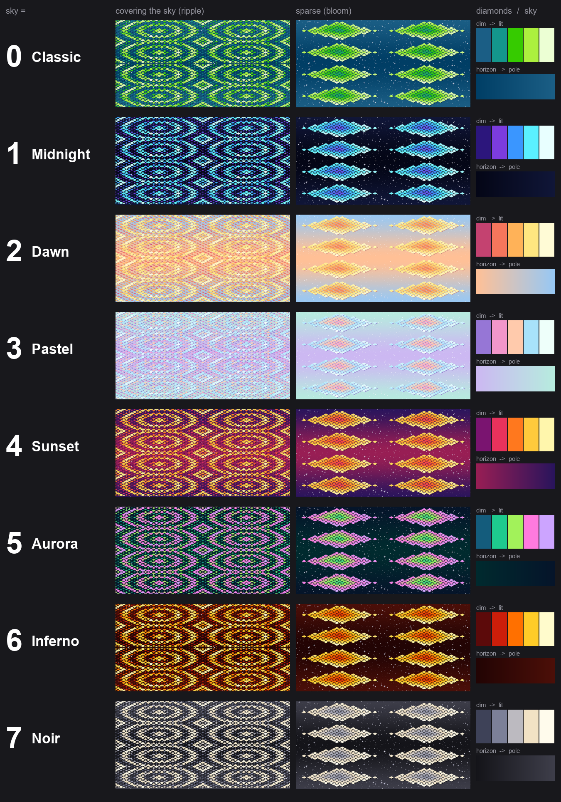

# The skies

Eight skies, one number each. Set `sky` on the **SkyDome** node (in the inspector, or
from a level script) and it changes on the next tick.

| `sky` | Name | Sky | Diamonds, dim to lit |
|---|---|---|---|
| **0** | Classic | deep blue | blue, teal, green, lime, pale mint |
| **1** | Midnight | near-black navy | deep violet, purple, azure, cyan, ice white |
| **2** | Dawn | peach horizon, pale blue above | rose, coral, apricot, gold, cream |
| **3** | Pastel | lavender horizon, mint above | periwinkle, pink, peach, sky blue, mint white |
| **4** | Sunset | magenta horizon, indigo above | plum, crimson, orange, amber, pale yellow |
| **5** | Aurora | dark teal | deep teal, green, lime, pink, lilac |
| **6** | Inferno | black-red | dark red, red, orange, yellow, white-hot |
| **7** | Noir | charcoal | blue-grey, slate, silver, cream, warm white |

Dawn and Pastel are the two light skies; white stars are faint on them.

## What a sky is

The same starfield, the same diamond show, the same dome and material -- only the
textures differ. A sky is a full set of them: 8 star frames with that sky's gradient
painted under the stars, and the 384 medley frames in that sky's diamond colours.
About 230MB of project files each, 10MB in git.

The colours have to live in the frames. Splitting colour from shape, so that a sky
would be two tiny gradients, was tried and reverted: the diamonds' colour comes from
the patterns themselves -- how lit each diamond is -- and as plain light and dark over a
separate colour layer it looked flat.

| | Where |
|---|---|
| Classic (0) | `proj/Assets/Textures/T_S2Sky_*`, made by `native/gen_s2sky_assets.py` |
| 1-7 | `proj/Assets/Skies/<Name>/T_Sky<Name>_*`, made by `native/gen_sky_variants.py` |

Changing sky does not restart the show: `Sky.lua` keeps the medley's clock and loads the
new sky's frames outward from the one being shown, so the colours change at once and
the pattern carries on. A sky that is not there falls back to classic and says so once.

## How the diamonds get their colour

Each diamond in the show has a **level**, from dim to lit, which is what the patterns
animate. Two things turn a level into a colour:

* **A five-stop ramp, in sixteen steps.** The first version had two colours and eight
  steps, so a whole pattern was "colour A, colour B and a few blends" and there was not
  much to look at. Each ramp now moves through hue as well as brightness and ends near
  white, so the brightest diamonds flare.
* **Drift by position.** Without it, two diamonds showing the same level are identical
  and a pattern that covers the sky evenly is one flat colour. Each diamond's colour is
  pulled a little (`DRIFT`, 0.28) by where it sits; the pull runs a whole number of times
  across the tile both ways, so it never shows a seam.

## Changing one

Colours are one row per sky: `SKIES` at the top of `native/gen_sky_variants.py` (sky at
the horizon, sky at the poles, the shadow under a diamond, the five stops), and
`MEDLEY_STOPS` plus `SKY_DEEP` / `SKY_LIFT` in `native/gen_s2sky_assets.py` for classic.

    python native/gen_sky_variants.py Pastel     # one sky; about eight seconds
    python native/gen_sky_variants.py            # all seven
    python native/gen_s2sky_assets.py            # classic
    python native/make_sky_chart.py              # redraw the chart above

All need Pillow. An editor that is already open keeps the old textures in memory;
restart it to see regenerated ones. To drop a sky, delete its folder -- nothing else
refers to it -- and take its name out of `SKY_NAMES` in `Sky.lua` and `SKIES` in the
generator, keeping the two lists in the same order.
